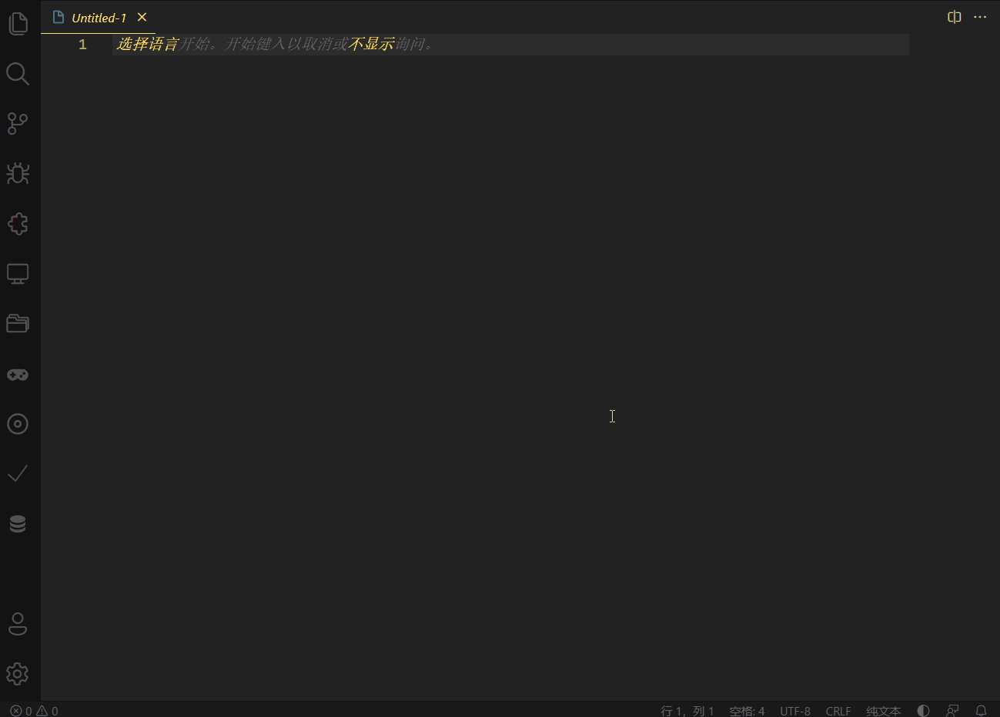

# 暗黑模式切换

一键切换暗黑模式，支持定制自己喜欢的亮色主题和暗色主题，并在两种主题之间一键切换。

## 使用方法

* 快捷键方式
默认`Alt+x`切换主题，也可以通过`文件->首选项->键盘快捷方式`面板搜索`darkmodeswitch`自定义快捷键。

* 右下角状态栏按钮方式

## 自定义主题
通过`文件->首选项->设置`搜索`darkmodeswitch`，可以通过GUI修改默认明亮主题

* 提示：可以通过`ctrl+k ctrl+t`查看已安装的主题名称

